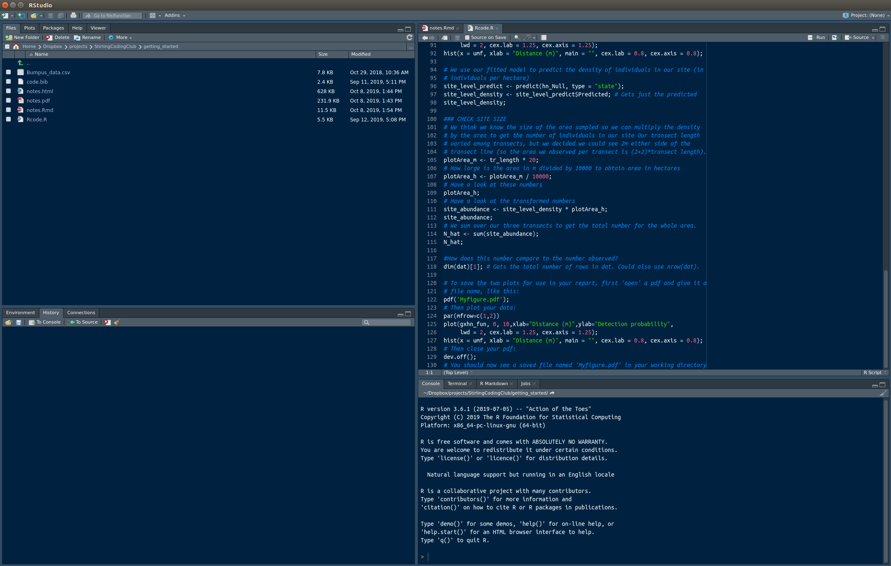
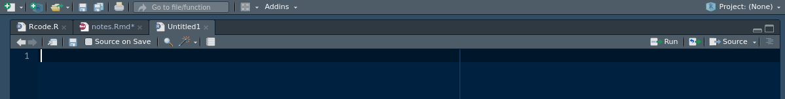
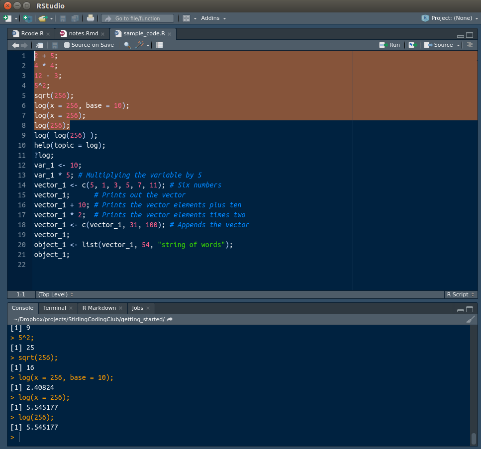

The purpose of this introduction
================================================================================

The purpose here is to get readers past the initial learning curve of coding as quickly as possible. If you want to start coding for yourself, particuarly in R for data analysis, but are not sure where to start, then read on. By the end of these notes, you should be able to navigate through the basic graphical user interface of Rstudio and write some basic lines of code. The goal is not to develop proficiency in coding or R yet, but to help you get to the point at which it is possible to write and run code, make coding mistakes, and learn from other researcher's code.

Why use the R programming language?
================================================================================

The computer programming language R is a powerful and very widely-used tool among biologists for analysing data. You can use it to analyse and plot data, run computer simulations, or even write slides, papers, or books. The R programming language is completely free and open source, as is the popular [Rstudio](https://www.rstudio.com/) software for using it. It specialises in statistical computing, which is part of the reason for its popularity among scientists. 

Another reason for its popularity is its versatility, and the ease with which new techniques can be shared. Imagine that you develop a new method for analysing data. If you want other researchers to be able to use your method in their research, then you could write your own software from scratch for them to install and use. But doing this would be very time consuming, and a lot of that time would likely be spent writing the graphical user interface and making sure that your program worked across platforms (e.g., on Windows and Mac). Worse, once written, there would be no easy way to make your program work with other statistical software should you need to integrate different analyses or visualisation tools (e.g., plotting data). To avoid all of this, you could instead just present your new method for data analysis and let other researchers write their own code for implementing it. But not all researchers will have the time or expertise to do this.

Instead, R allows researchers to write new tools for data analysis using simple coding scripts. These scripts are organised into R packages, which can be uploaded by authors to the [Comprehensive R Archive Network (CRAN)](https://cran.r-project.org/), then downloaded by users with a single command in R. This way, there is no need for completely different software to be used for different analyses -- all analyses can be written and run in R.

**The downside to all of this** is that learning R can be a bit daunting at first. Running analyses is not done by pointing and clicking on icons as in Excel, SigmaPlot, or JMP. You need to use code. Here we will start with the very basics and work our way up to some simple data analyses.

Getting started in R, and the basics
================================================================================

**Installation.** The first thing to do is [download Rstudio](https://www.rstudio.com/) if you have not already. Note that R and Rstudio are not the same thing; R is a language for scientific computing, and can be used outside of Rstudio. Rstudio is a very useful tool for coding in the R language. As a loose analogy, R is like a written language (e.g., English, Spanish) that can be used to write inside Rstudio (e.g., a word processor such as Microsoft Word, LibreOffice). But by downloading Rstudio, you will also download the R programming language. Look carefully at the version of Rstudio that you download; [different installers](https://rstudio.com/products/rstudio/download/#download) exist for Windows, Mac, and Linux. The most recent version of Rstudio requires a [64-bit](https://en.wikipedia.org/wiki/64-bit_computing) operating system. Unless your computer is quite old (over seven years), you most likely have a 64-bit operating system rather than a [32-bit](https://en.wikipedia.org/wiki/32-bit) operating system, but if you are uncertain, then it is best to check.

**Running Rstudio.** When you first run Rstudio, you will see several windows open. It will look something like the below, except probably with a standard black on white theme (if you want, you can change this by selecting from the toolbar 'Tools > Global Options...', then selecting the 'Appearance' tab on the left).



This might look a bit intimidating at first. Unlike Microsoft Excel, SigmaPlot, or JMP, there is no spreadsheet that opens up for you. You interact with R mostly by typing lines of commands rather than using a mouse to point and click on different options. Eventually, this is liberating, but at first it will probably feel overwhelming. First, let us look at all of the four panes in the Figure above. Your panes might be organised a bit differently, but the important ones to start out with are the 'Source' and the 'Console'. These are shown in the right hand panes in the above Figure.

To make sure that the Source pane is available to you, open an new R script by selecting from the toolbar 'File > New File > Rscript' (shortcut: Shift+Ctrl+N). You should see a new Rscript open up that looks something like the below (the colour scheme might differ).



Think of this Source file like a Word document that you have just opened up -- completely blank and ready for typing new lines of command to read in data and run analyses. We will come back to this Source file, but for now just know that the Source file stores commands that we want R to intepret and use. The Source file does this by sending commands to the R console, which we will look at now.

The R console should be located somewhere in Rstudio (I like to keep it directly underneath my R Source files). You can identify it by finding the standard R information printed off, which should look something like the below.

```
R version 3.6.1 (2019-07-05) -- "Action of the Toes"
Copyright (C) 2019 The R Foundation for Statistical Computing
Platform: x86_64-pc-linux-gnu (64-bit)

R is free software and comes with ABSOLUTELY NO WARRANTY.
You are welcome to redistribute it under certain conditions.
Type 'license()' or 'licence()' for distribution details.

  Natural language support but running in an English locale

R is a collaborative project with many contributors.
Type 'contributors()' for more information and
'citation()' on how to cite R or R packages in publications.

Type 'demo()' for some demos, 'help()' for on-line help, or
'help.start()' for an HTML browser interface to help.
Type 'q()' to quit R.

> 
```

The console is where all of the code is run. To get started, you can actually ignore everything else and just focus on this pane. If you click to the right of the greater than sign `>`, you can start using R right in the console. To get a feel for running code in the console, you can use the R console as a standard calculator. Try typing something like the below to the right of the `>`, then hit 'Return' on your keyboard (note, all of my semi-colons are optional).

```{r, echo = TRUE}
2 + 5;  
```

Now try some other common mathematical operations, one line at a time.

```{r, echo = TRUE}
4 * 4;  
12 - 3; 
5^2;
```

Notice that R does the calculation of each of the above mathematical operations and returns the correct value on the line below. If you are familiar with using Microsoft Excel, this is the equivalent to typing `= 2 + 5`, `= 4 * 4`, etc., into a cell of an Excel spreadsheet. You might also be familiar with spreadsheet functions as well, such as the square root function, which you could use in Excel by typing, e.g., `= sqrt(25)` into a spreadsheet cell. This works in the R console too; the functions actually have the same syntax, so you could type the below into the console and hit 'Enter'.

```{r, echo = TRUE}
sqrt(256);
```

The console returns the correct answer `r sqrt(256)`. Similar functions exist for logarithms (`log`) and trigonmetric functions (e.g., `sin`, `cos`), as they do in Microsoft Excel. But this is just the beginning in R. Functions can be used to do any number of tasks. Some of these functions are built into the base R language, others are written by researchers and distributed in [R packages](https://cran.r-project.org/web/packages/available_packages_by_name.html), but you can also learn to write your own R functions to do any number of customised tasks. You will need to use functions in nearly every line of code you write (technically, even the `+`, `-`, etc., are also functions), so it is good to know the basics of how to use them. 

Most functions are called with open and closed parentheses, as in the `sqrt(256)` above. The `sqrt` is the function, while the `256` is a function argument. An argument is a specific input to a function, and functions can take any number of arguments. For the `sqrt` function, only one argument is needed, but many arguments will have more than one argument. For example, if we want to take the logarithm of some number using the `log` function, we might need to specify the base. In this case, we clarify the number for which we want to compute the log `x` and the logarithm base `base`. Let us say that we want to compute the logarithm of 256 in base 10.

```{r, echo = TRUE}
log(x = 256, base = 10);
```

Note that some arguments are required, while some are optional. In the case of `log`, the first argument is required, but the base is actually optional. If we do not specify a `base`, then the function simply defaults to calculating the natural logarithm (i.e., base $e$). Hence, the below also works (note that we get a different answer because the bases differ).

```{r, echo = TRUE}
log(x = 256);
```

In fact, we do not even need to specify the `x` because only one argument is needed for the `log` function. Hence, if only one argument is specified, the function just assumes that this argument is `x`. Try the below.

```{r, echo = TRUE}
log(256);
```

Note that functions can be nested inside other functions, though this can get messy. For example, if you wanted to get the logarithm of the logarithm of 256, then you could write the below.

```{r, echo = TRUE}
log( log(256) );
```

Also note that functions do not need to be mathematical in R; they do not even need to operate on numbers. One very useful function is the `help` function, which provides documentation for other R functions. If, for example, we were not sure what `log` did, or what arguments it accepted, then we could run the code below.

```{r, echo = TRUE, eval = FALSE}
help(topic = log);
```

Try running the above line of code in the R console. You should see a description of the `log` function, along with some examples of how it is used and the two arguments (`x` and `base`) that it accepts. Anytime you get stuck with a function, you should be able to use the `help` function for clarification. You can even use a shortcut that returns the same as the `help(topic = log);` above.

```{r, echo = TRUE, eval = FALSE}
?log;
```

We now have looked at three functions, `sqrt`, `log`, and `help`. If you have previous experience with Microsoft Excel spreadsheets, you should now be able to make the conceptual connection between typing `=sqrt(25)` into a spreadsheet cell and `sqrt(25)` into the R console. You should also recognise that R functions serve a much broader set of purposes in R. Next, we will move onto assigning variables in the R console.

<!--- 
But functions do not need to be mathematical; for example, the `getwd` function can be used to let you know what directory (i.e., folder) you are working in.

```{r, echo = TRUE}
getwd();
```

So if we were to save or load a file within R, this is the location on the computer from which R would try to load. We could also use the `setwd` function to set a new working directory (type the working directory in quotes inside the parentheses: `setwd("folder/subfolder/etc")`). You can also set the working directory in Rstudio by going to the toolbar and clicking Session > Set Working Directory.

--->

Assigning variables in the R console
================================================================================

In R, we can also assign values to variables using the characters `<-` to make an arrow. Say, for example, that we wanted to make `var_1` equal 10.

```{r, echo = TRUE}
var_1 <- 10;
```

We can now use `var_1` in the console.

```{r, echo = TRUE}
var_1 * 5; # Multiplying the variable by 5
```

Note that the correct value of `r var_1 * 5` is returned because `var_1` equals `r var_1`. Also note the comment left after the `#` key. In R, anything that comes after `#` on a line is a comment that R ignores. Comments are ways of explaining in plain words what the code is doing, or drawing attention to important notes about the code.

Note that we can assign multiple things to a single variable. Here is a vector of numbers created using the `c` function, which combines multiple arguments into a vector or list. Below, we combine six numbers to form a vector called `vector_1`.

```{r, echo = TRUE}
vector_1 <- c(5, 1, 3, 5, 7, 11); # Six numbers
```

We can now print and perform operations on `vector_1`.

```{r, echo = TRUE}
vector_1;      # Prints out the vector
vector_1 + 10; # Prints the vector elements plus ten
vector_1 * 2;  # Prints the vector elements times two
vector_1 <- c(vector_1, 31, 100); # Appends the vector
vector_1;
```

We can also assign lists, matrices, or other types of objects using the `list` function.

```{r, echo = TRUE}
object_1 <- list(vector_1, 54, "string of words");
object_1;
```

Play around a bit with R before moving on, and try to get confortable using the console. When you have finished with the R console, continue reading to learn how to store lines of code using an R script.

Using R script to save and run code
================================================================================

Up until now, we have focused on running code directly into the console. This works, but if you want to run multiple lines of code, or just save your code for later use, then you will need more than the console. R scripts are [plain text](https://en.wikipedia.org/wiki/Plain_text) files with a '.R' extension, which can be used to save R code. The R code itself is no different than what we have already run into the console. For example, we could save an R file with all of the code that we have read into the console up to this point; it would look like the below.

```{r, echo = TRUE, eval = FALSE}
2 + 5; 
4 * 4;  
12 - 3; 
5^2;
sqrt(256);
log(x = 256, base = 10);
log(x = 256);
log(256);
log( log(256) );
help(topic = log);
?log;
var_1 <- 10;
var_1 * 5; # Multiplying the variable by 5
vector_1 <- c(5, 1, 3, 5, 7, 11); # Six numbers
vector_1;      # Prints out the vector
vector_1 + 10; # Prints the vector elements plus ten
vector_1 * 2;  # Prints the vector elements times two
vector_1 <- c(vector_1, 31, 100); # Appends the vector
vector_1;
object_1 <- list(vector_1, 54, "string of words");
object_1;
```

You can find and download the code above in the file [sample_code.R](https://github.com/StirlingCodingClub/getting_started/blob/master/sample_code.R) on GitHub. If you wanted to redo all of the calculations in this R script, you could open it and run each line one by one, or as a group. In the figure below, I have read [sample_code.R](https://github.com/StirlingCodingClub/getting_started/blob/master/sample_code.R) into R by first saving it to my computer, then from the toolbar selecting 'File > Open File...' and opening it from the saved location.



There are a few things to note in the Figure above. First, the script [sample_code.R](https://github.com/StirlingCodingClub/getting_started/blob/master/sample_code.R) now sits above the console; the position of the script might be different depending on your pane settings, but you should be able to see it appear somewhere after opening the file. Second, note how different parts of the text in the R script are coloured differently; this makes reading the text a bit easier. The variables, assignments, arguments, and functions, all appear in white. Numbers are shown in pink, strings of words are in green, and comments are in light blue (your colours might differ, but you should see some distinction among different types of text). Third, note the 'Run' button in the upper right corner above the script. This allows you to run the commands in the R script lines directly into the R console so that you do not have to retype them directly.

You can read the code from the Rscript into the console in multiple ways. The easiest is to simply click with your mouse on whatever line you want to run, then click the 'Run' button. Try clicking anywhere on line 1, for example, so that the cursor is blinking somewhere on the line. Then click 'Run'; you should see `> 2 + 5` appear in the R console, followed by the correct answer `r 2+5`. After you have done this, R moves the cursor to the next line in anticipation of you wanting to run line 2. If you want to run line 2, then you could just hit 'Run' again, and repeat for line 3, 4, etc. Give this a try.

If you do not want to go through all of the code line by line, you could instead highlight a block of code, as I did above for lines 1-8. If you highlight these lines, then click 'Run', the R console will run every line one after another, producing the output shown in the console of the Figure above. Try this as well to get a feel for running multiple lines of code at once. You now know the basics of getting started with coding in R. Next, we will move onto reading data into R for analysis, and doing a very simple correlation analysis on the classic [Bumpus data set](https://www.fieldmuseum.org/blog/hermon-bumpus-and-house-sparrows) [@Bumpus1898; @Johnston1972]. Very briefly, the Bumpus data includes characteristics and morphological measurements from sparrows in North America following a severe storm (the specifics are not important for our purposes).

Reading in data
================================================================================

Now we need to read in the Bumpus data. This is actually a challenging part because the data needs to be in a correct format and location to be read into R successfully. The format is best read in as a CSV file, though other formats are also possible (TXT can work, or XLSX if you download and load the `openxlsx` R package and use the `read.xlsx` function). For now, I will use a CSV file with the [Bumpus data set](https://www.fieldmuseum.org/blog/hermon-bumpus-and-house-sparrows). Reading CSV files into R can be challenging at first, and I encourage you to first read in the example data set, then try reading in your own data sets into R. You can read your own dat sets into R by saving them as CSV files in Excel; as a general rule, it is good to avoid spaces in these files (replacing them, e.g., with an underscore '_'). Also make sure that all rows and columns are filled in; any empty values can be replaced with an `NA`, which R reads as unavailable data. See the [Bumpus CSV file](https://github.com/StirlingCodingClub/getting_started/blob/master/Bumpus_data.csv) online to get an idea of what a data file looks like.

Two common errors arise at this point, which can be sources of frustration for getting started. First, the data might not be organised correctly for reading into R. Note that rows and columns should start in row '1' and column 'A' of Excel (i.e., don't leave empty rows and columns), and additional cells should not be used outside of rows and columns (if, e.g., you have a value in cell M4, when the last column in your table is K, then R will intepret this as column L being full of empty values). You should be fine if R includes some number of completely filled in rows and columns, with nothing filled in outside. If you want to, you can download the [Bumpus CSV file](https://www.dropbox.com/s/8ytv36kbahhcpbs/Bumpus_data.csv?dl=0) from Dropbox and open it up in Excel for an example of what a good CSV file looks like. Note that there are no empty cells inside the table, and no values outside the table. This should therefore be read easily into R.

Second, you need to make sure that the file you are trying to read into R is located in the same place as your current working directory. You can see what your current working directory (i.e., 'folder') is using the command below.

```{r, echo = TRUE}
getwd(); # No argument is needed here for the function
```

The above function returns the current working directory. If this is the same as the CSV file that you want to read into R, then all is well. But if this is not the working directory where your CSV file is located, then you need to find it. You could do this from the R console, but the easiest way is to go to the toolbar and go to 'Session > Set Working Directory > Choose Directory...' and find the location where your CSV file is saved. The easiest way to do this is to save your data in the same place that you have saved your R script. If you do this, then you can simply go to 'Session > Set Working Directory > To Source File Location', and R will set the directory to the same file as your current R script. From there you can read in your CSV file with the `read.csv` function in R. Note that the first row of the file 'Bumpus_data.csv' is a header, which gives the column names, so we should specify the argument 'header = TRUE'.

```{r, echo = TRUE}
dat <- read.csv(file = "Bumpus_data.csv", header = TRUE);
```

If you get an error message, double-check that the file name and the working directory are correct (if there is an error, this is the problem most of the time). Note that the **everything in R is case sensitive**. That means that if a letter is capitalised in the file name, but you do not capitalise it in the `file` argument above, then R will not recognise it. A lot of errors are caused by capitalisation issues in R.

Once you have succeeded in reading in a file without getting an error message, to make sure that everything looks correct, you can type `dat` in the console to see all of the data print out. I will use the 'head' function below to just print off the first six rows.

```{r, echo = TRUE}
head(dat);
```

If the data appear to be read into R correctly, then you can move on to working with the data and performing analyses in R. Note that `dat` is a big table that is now read into R. While we do not necessarily see the entire table at once, as we would in Excel, we can pull out any of the information in that we want. For example, if we want to see how many rows and columns are in `dat`, we can use the following functions.

```{r, echo = TRUE}
nrow(dat);
ncol(dat);
```

We could also just use the function `dim` to get the dimensions of `dat` (note that this would work for an array of any number of dimensions).

```{r, echo = TRUE}
dim(dat);
```

So we know that our table `dat`, which contains the Bumpus data, includes `r dim(dat)[1]` rows and `r dim(dat)[2]` columns. Having read this table into R successfully, we can now perform any number of statistical analyses on the contents. The different ways to analyse theses data are beyond the scope of these notes, but there are a few useful things to know. First, the row and columns in `dat` can be indext using square brackets. If, for example, we wanted to just look at the value of the fourth row and sixth column, we could type the following.

```{r, echo = TRUE}
dat[4, 6]; # First row, second column
```

The first position within the brackets is the row (`4`), and the second position is the column (`6`). Note that R is not restricted to two dimensions; it is possible to have three or more dimensions of an array, in which case we might refer to an array element as `dat[x_dim, y_dim, z_dim]` for a `dat` of three dimensions. Note that we can also store any particular value in `dat` as a variable, if we want. We could, for example store the above as `dat_point_1` using the code below.

```{r, echo = TRUE}
dat_point_1 <- dat[4, 6];
```

We could then use `dat_point_1` in place of dat[, 6]. We can also define entire rows or columns. For example, if we wanted to return all of the values of row 4, then we could leaven the second index blank, as below.

```{r, echo = TRUE}
dat[4, ]; # Note the empty space where a column was previously
```

In the Bumpus data set, this gives us all the information of measurements for sparrow number 4. We can do the same for columns. Note that column 5 holds the mass of each sparrow (in grams). We could look at all of the sparrow masses using the code below.

```{r, echo = TRUE}
dat[, 5]; # Note the empty space is now where a row used to be.
```

Note that this now returns the masses of all `r dim(dat)[1]` sparrows. Since our table has headers, and the header for column 5 is `r colnames(dat)[5]`, we could also use the code below.

```{r, echo = TRUE}
dat$wgt; # R sees the column header and returns column 5; same as above
```

Even better, we can plot a histogram of sparrow weights using the built-in function `hist` in R. 

```{r, echo = TRUE}
hist(x = dat$wgt);
```

This looks a bit rubbish; the main title is unnecessary, and the axis labels are not terribly informative. We can tweak the axis labels and colours using the following arguments.

```{r, echo = TRUE}
hist(x = dat$wgt, main = "", xlab = "Sparrow weight (g)", ylab = "Frequency",
     cex.lab = 1.25, cex.axis = 1.25, col = "grey");
```

Some basic analyses
================================================================================

Since the R programming language is developed primarily for scientific analysis and statistical computing, there are several built-in functions for doing simple analyses. More complex analyses that are not possible with in-build tfunctions can be performed by downloading R packages. If you have heard of an analysis, it is probably available within an R package. For now, let us just do some basic statistical analyses. For example, let us say that we want to summarise the data on sparrow body mass. We can do this with the `summary` function in R.

```{r, echo = TRUE}
summary(dat$wgt);
```


The `summary` function returns six numbers, including the minimum value, first quartile, median, mean, third quartile, and maximum value of numbers in the data, in this case a column of sparrow body masses. Now say that we want to see if sparrow body mass is correlated with sparrow body length (`dat$totlen` in our data frame). We could first look at a scatter plot of body mass versus length.

```{r, echo = TRUE}
plot(x = dat$wgt, y = dat$totlen, xlab = "Sparrow body mass (g)", 
     ylab = "Sparrow body length (mm)", cex.lab = 1.25, cex.axis = 1.25,
     pch = 20); # Note: cex.lab, cex.axis, and pch are purely cosmetic
```

It clearly looks like there is a correlation between the two variables of interest. We can find out what this correlation is below.

```{r, echo = TRUE}
cor(dat$wgt, dat$totlen);
```

Hence, the correlation between sparrow body mass and sparrow total body length is `r cor(dat$wgt, dat$totlen)`. We can even test to see if this correlation is significant using the `cor.test` function.

```{r, echo = TRUE}
cor.test(dat$wgt, dat$totlen);
```

As you can see above, this returns the correlation, along with a t-statistic, degrees of freedom, p-value, and confidence interval for the Pearson product-moment correlation between the two variables of interest. If we wanted to instead run a simple linear regression of body total length against body mass, we could use the `lm` function as below.

```{r, echo = TRUE}
lm(dat$totlen ~ dat$wgt);
```

Note that the above function returns the intercept and slope, but not any results from statistical null hypothesis tests. To do this, we need to wrap `lm` in the function `summary`, as below.

```{r, echo = TRUE}
summary( lm(dat$totlen ~ dat$wgt) );
```

Now we get a bit more information, including significance tests for our intercept `(Intercept)` and slope `dat$wgt`. The linear model function (`lm`), and the generalised linear model function (`glm`) are very flexible, and can be used for a variety of purposes that I will not elaborate on here, except for one more example. Let us look at the categorical variable of sparrow sex, and test whether or not bird mass difference between sexes. To do this, we could use a simple t-test with the `t.test` function below.

```{r, echo = TRUE}
t.test(dat$wgt ~ dat$sex);
```

Since a t-test is mathematically identical to an linear model with two categorical response variables, we could also use the `lm` function to do the same null hypothesis test.

```{r, echo = TRUE}
summary( lm(dat$wgt ~ dat$sex) );
```

The point here is not to demonstrate all of the different statistics that can be performed within R. Because R is a programming language, the possibilities are limitless; in the unlikely chance that no one has written code for a particular statistical analysis that you need to perform, you could write your own code to do the analysis yourself.


Appendix: R script file {#appendix}
================================================================================

```{r, eval = FALSE}
# Here is your first R script. 
```

--------------------------------------------------------------------------------

References
================================================================================
