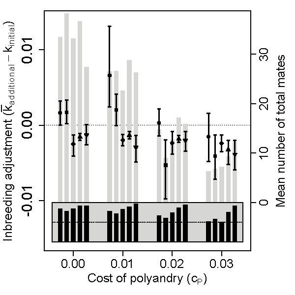

# Stirling Coding Club

\LARGE 

*"Coding Club is for everyone, regardless of their career stage or current level of knowledge. Coding Club is a place that brings people together, regardless of their gender or background. We all have the right to learn, and we believe learning is more fun and efficient when we help each other along the way."* -- [Edinburgh Coding Club](https://ourcodingclub.github.io/)


# Stirling Coding Club

\LARGE

- Alternates weeks with Stats Discussion Group \pause
- Detailed notes posted on Monday \pause
- Meeting on Wednesday, then try notes with live help or walk-through \pause
- Questions on MS Teams chat afterwards \pause
- Participate as much or as little as you prefer!


# Stirling Coding Club in 2022-2023

1. Getting started in R (08 NOV 2023)
2. General computing concepts (22 NOV 2023)
3. Writing and using functions (06 DEC 2023)
4. Writing and using loops (17 JAN 2024)
5. Simulating data in R (31 JAN 2024)
6. Introduction to version control (14 FEB 2024)
7. Slides in Rmarkdown (28 FEB 2024)
8. Manuscripts in Rmarkdown (13 MAR 2024)
9. Rshiny applications (27 MAR 2024)
10. Randomisation in R (10 APR 2024)
11. Writing tests for code (24 APR 2024)
12. Individual-based modelling (08 MAY 2024)
13. Creating R packages (22 MAY 2023)

\vspace{4mm}

\hrule

[https://stirlingcodingclub.github.io/studyGroup/](https://stirlingcodingclub.github.io/studyGroup/)

# Do I need to learn how to code?

\Large

\textbf{Is this a necessary skill in the sciences?} \pause

\normalsize

\begin{table}[]
\begin{tabular}{p{5.5cm}|p{5cm}|}
Not only is coding a core skill that gets the basic work of biology done, it's also taught [biologists] to look at problems in new ways. Above all, they agree, \textbf{coding liberated them}. As tools evolve to allow biologists to gather ever-more-massive quantities of data, people [...] will find a way to make coding a core part of scientific education$^1$. &  [T]here's nothing wrong with becoming an expert (or close to one) in a given skill set (e.g., statistics, coding), and \textbf{it also will be a good thing as a biologist}. But I don’t think coding will be the must-have skill set a few years from now (except for those who develop new tools)$^2$.
\end{tabular}
\end{table}

\footnotetext[1]{Dreyfuss (2017). Wired. \href{https://www.wired.com/2017/03/biologists-teaching-code-survive/}{https://www.wired.com/2017/03/biologists-teaching-code-survive/}.}
\footnotetext[2]{Mike (2019). \href{https://mikethemadbiologist.com/2019/12/06/biologists-should-not-learn-how-to-code/}{https://mikethemadbiologist.com/2019/12/06/biologists-should-not-learn-how-to-code/}.}

# How does coding (specifically R) help me as a researcher?

Most scientific research relies on numeric data.
\begin{itemize}
\setlength\itemsep{-0.2em}
\item Data organisation
\item Statistical analysis
\item Visualisation
\end{itemize}

\vspace{2mm}\pause

Software exists that can do the above without code.
\begin{itemize}
\item \href{www.jmp.com}{JMP}, \href{https://www.minitab.com/en-us/products/minitab/?utm_campaign=BFO+-+US+-+EN&utm_medium=ppc&utm_term=minitab&utm_source=adwords&hsa_net=adwords&hsa_mt=e&hsa_ver=3&hsa_grp=75045421894&hsa_ad=381051763423&hsa_tgt=kwd-298703240867&hsa_cam=2063260456&hsa_acc=4841564033&hsa_src=g&hsa_kw=minitab&gclid=Cj0KCQiAqNPyBRCjARIsAKA-WFzHJH4aiDsh90CMsg3rYeLEQGeeYBSDui1ZNZjBU2624YCsei5yhnEaAu7lEALw_wcB}{Minitab}, \href{https://systatsoftware.com/}{Systat}, \href{https://products.office.com/en/excel}{MSExcel}, \href{https://www.ibm.com/uk-en/products/spss-statistics}{SPSS}, \href{https://www.jamovi.org/}{Jamovi}
\end{itemize}

\vspace{5mm}\pause

Practical advantages of using these software tools
\begin{itemize}
\setlength\itemsep{0em}
\item Graphical User Interface (no need to work with code).
\end{itemize}

# How does coding (specifically R) help me as a researcher?

Practical advantages of learning and using R

\begin{itemize}
\setlength\itemsep{0em}
\item R software is entirely free and open source \pause
\item Thousands \href{https://cran.r-project.org/web/packages/available_packages_by_date.html}{R packages} for specific data needs \pause
\item Standard programming language for statistics \pause
\item Write \href{https://stirlingcodingclub.github.io/Manuscripts_in_Rmarkdown/Rmarkdown_notes.html}{papers}, \href{https://stirlingcodingclub.github.io/Manuscripts_in_Rmarkdown/presentation.pdf}{slides}, and \href{https://bradduthie.shinyapps.io/gmse_gui/}{apps} in Rmarkdown \pause
\item \textbf{Write your own solutions to data management problems}
\item \textbf{Write your own statistical analyses}
\item \textbf{Create your own plots} \pause
\end{itemize}

\vspace{3mm}

\textbf{A lot of coding is Googling solutions to get the code to work.}

# Write your own solutions to data organisation problems

```{r, echo = FALSE}
library(knitr);
tom <- read.csv("Tom_data.csv", header = TRUE);
print(tom);
```

\vspace{2mm}

\hrule

\vspace{2mm}

\begin{small}
\textbf{Calc. the cumul\_mn for the BAI col. every year for each tree}$^1$: \pause
\begin{itemize}
\setlength\itemsep{0em}
\item Do not include \textit{current} BAI record in cumul\_mn calc
\item If the \texttt{Year SPEI} is >1 or -1, never include the BAI value
\item If the \texttt{Year - 1 SPEI} is  >1 or <-1, never include the BAI value
\item If the \texttt{Year - 2 SPEI} is  >1.5 or <-1.5, never include the BAI value
\item If the \texttt{Year - 3 SPEI} is  >2 or <-2, never include the BAI value
\end{itemize}
\end{small}

\footnotetext[1]{Thanks to \href{http://forest-ecology.com/about/}{Tom Ovenden} for letting me use this example.}

# Write your own solutions to data organisation problems

\textbf{Solution took 65 lines of code written in 3 custom functions.}

\vspace{2mm}

```{r}
tree_cumulative_mean <- function(dat){
    trees     <- unique(dat$Tree_ID);
    new_table <- NULL;
    for(tree in trees){
        sub_dat    <- dat[dat$Tree_ID == tree,];
        tree_cumul <- get_cumulative(tree = sub_dat);
        new_tree   <- update_cumul(tree = sub_dat,  
                                   vec  = tree_cumul);
        new_table  <- rbind(new_table, new_tree);
    }
    return(new_table);
}
```

The above is the 'outermost' function.

# Write your own statistical analyses

\textbf{Testing the effects of fig tree spatial distributions on pollinator, seed, and parasite distributions.}

```{r, echo=FALSE, out.width = "100%", fig.align="center"}
include_graphics("figures/fig_tree.jpg")
```

\footnotetext[1]{Duthie AB, Nason JD (2016) \textit{Oikos} \href{https://doi.org/10.1111/oik.02629}{125(11):1597-1606}.}

# Write your own statistical analyses

```{r, echo = FALSE}
NeighAn <- read.table(file="figwasp_eg/FpetWasp_Data.csv", header = TRUE);
use     <- c(1:3, 9, 10, 18, 20:21);
NeighAn[1:8, use];
```

\vspace{2mm}
\hrule \pause
\vspace{2mm}

\begin{itemize}
\setlength\itemsep{0em}
\item Needed to use mean tree values and a custom index of fig wasp dispersal ability \pause
\item Wanted to make \href{https://github.com/bradduthie/Duthie_and_Nason_2016}{analysis open source} and figures reproducible \pause
\item Had to help a colleague use the same analysis on new data
\end{itemize}


# Create your own plots

```{r, echo=FALSE, out.width = "60%", fig.align="center"}

```

Custom built plot [with R code](https://github.com/bradduthie/PolyInbreed/blob/master/PolyInbreeding_Analysis.R#L2004) for an individual-based model.

\footnotetext[1]{Duthie AB, et al. (2016) \textit{Evolution} \href{https://doi.org/10.1111/evo.13005}{70(9), 1927–1943}.}

# R is extremely useful for doing scientific research

\textbf{A bit of coding skill can save a lot of time in the long run.}

\begin{itemize}
\setlength\itemsep{0em}
\item You do not need to know everything
\item Help is available from many places
\end{itemize}

\vspace{3mm}

```{r, echo=FALSE, out.width = "40%", fig.align="center"}

```

\vspace{3mm}

https://stirlingcodingclub.github.io/getting_started/notes.html

https://ourcodingclub.github.io/tutorials/intro-to-r/

https://ourcodingclub.github.io/tutorials/troubleshooting/


